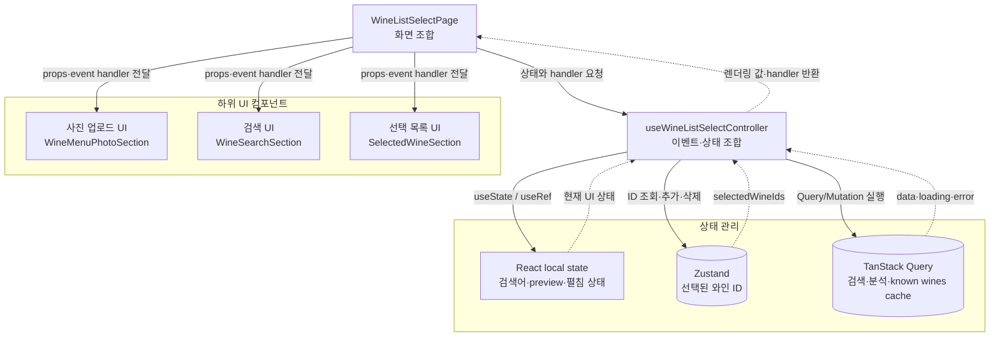
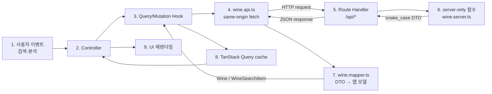
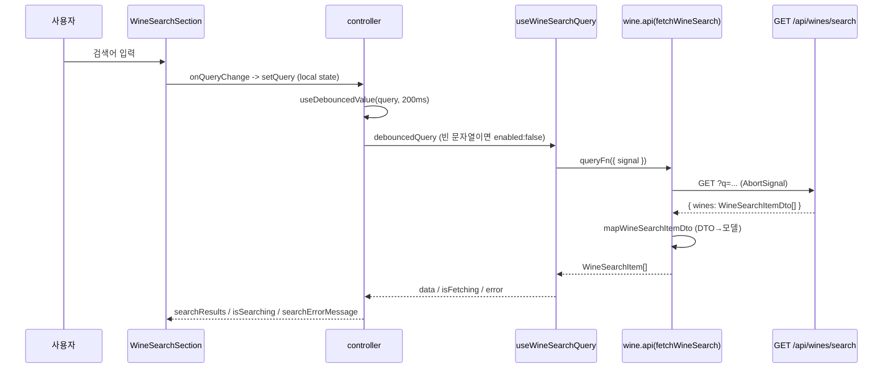
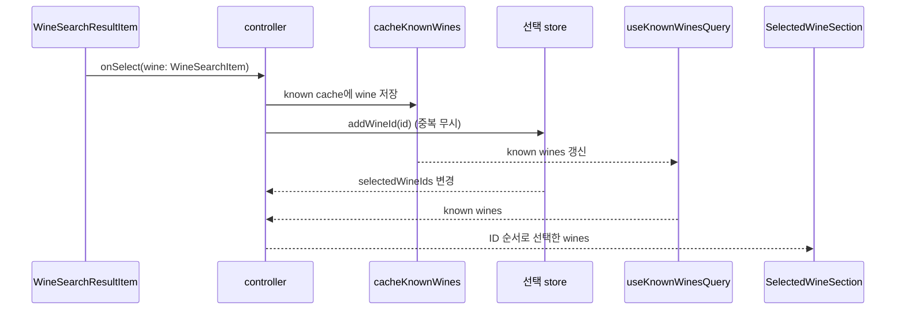

# WineListSelectPage 구조 및 데이터 흐름

`/wine/ai` 화면(와인 리스트 선택)의 **UI → 비즈니스 로직 → API** 처리 흐름과
레이어 구조를 정리한 문서다. 기준 컴포넌트는
`feature/wine-list-select/ui/WineListSelectPage.tsx`이다.

이 문서의 코드 경로는 별도 표기가 없으면 `web/src/app/`을 기준으로 한다.
계획 문서가 아니라 현재 구현을 설명하며, 코드 변경 시 함께 갱신한다.

## 1. 한눈에 보기

### UI와 상태 관리 구조



### API 요청과 응답 흐름



```txt
요청: UI → Controller → Query Hook → Entity API → Route Handler → server-only 함수
응답: server-only 함수 → Route Handler → Entity API → Mapper → Query cache → UI
```

핵심 원칙(P1 계획 기준):

- **서버 데이터는 TanStack Query에만 둔다.** 검색·분석 응답을
  `useState`/Zustand에 복제하지 않는다.
- **Zustand에는 선택 ID와 순서만 둔다.** 와인 카드 데이터는 검색·분석 응답으로
  채운 known wines cache에서 읽는다.
- **API 함수는 엔티티, Query/Mutation Hook은 Feature**에 둔다.
- UI 컴포넌트는 도메인 props만 받고 QueryClient·API URL을 모른다.

## 2. 레이어와 의존 방향

```txt
Route entry / Provider
        ↓
Feature UI
        ↓
Feature controller
    ↙         ↘
Feature Query     Zustand selection store
        ↓
Wine Entity API / model / mapper
        ↓
same-origin Route Handler
        ↓
server-only wine functions
```

| 레이어 | 주요 책임 | 알면 안 되는 것 |
|---|---|---|
| `wine/ai/page.tsx` | 페이지 진입점과 헤더/Feature UI 조합 | 검색·분석 이벤트 세부 구현 |
| `feature/.../ui` | 렌더링과 사용자 이벤트 전달 | API URL, QueryClient 조작 |
| `feature/.../model` | UI 상태, Query 결과, store action 조합 | Route Handler 내부 구현 |
| `feature/.../api` | query key와 Query/Mutation 캐시 정책 | JSX와 화면 레이아웃 |
| `entity/wine` | 와인 타입, DTO 변환, 네트워크 함수, 서버 조회 | 화면별 선택 상태 |
| `app/api` | 공개 HTTP 경계, 입력 검증, 안전한 DTO 응답 | React hook과 UI 타입 |

의존 방향은 위에서 아래로만 흐른다. 특히 Route Handler가 Feature UI나
Zustand store를 import하거나, UI가 `fetch("/api/...")`를 직접 호출하지 않는다.

## 3. 디렉터리 구조와 책임

```txt
src/app/
├─ wine/ai/page.tsx                     # Server Component (진입점)
├─ providers.tsx                        # QueryClient + 선택 store Provider
├─ shared/
│  ├─ api/query-client.ts               # 공통 QueryClient 기본값
│  └─ ui/molecule/page-header.tsx       # 공통 헤더
├─ entity/wine/
│  ├─ model/
│  │  ├─ wine.type.ts                   # Wine / WineSearchItem / DTO
│  │  └─ wine-menu-image.ts             # 업로드 검증 규칙(크기/타입)
│  └─ api/
│     ├─ wine.api.ts                    # 브라우저 fetch 함수
│     ├─ wine.mapper.ts                 # DTO → 앱 모델 변환
│     ├─ wine.server.ts                 # server-only mock/조회
│     └─ wine-menu-image.server.ts      # 매직바이트 시그니처 검증
├─ feature/wine-list-select/
│  ├─ api/
│  │  ├─ wine-query-keys.ts             # query key factory
│  │  ├─ use-wine-search-query.ts       # 검색 useQuery
│  │  ├─ use-known-wines-query.ts       # 알려진 와인 cache 구독
│  │  └─ use-analyze-wine-list-mutation.ts
│  ├─ lib/cache-known-wines.ts          # 알려진 와인 cache 갱신
│  ├─ model/
│  │  ├─ use-wine-list-select-controller.ts   # 조합 hook (비즈니스 로직)
│  │  ├─ use-debounced-value.ts
│  │  ├─ wine-list-selection.store.ts         # vanilla store factory
│  │  └─ wine-list-selection-provider.tsx     # Context Provider + selector hook
│  └─ ui/                               # 표현 컴포넌트(아래 3장)
└─ api/
   ├─ wines/search/route.ts
   └─ wine-lists/analyze/route.ts
```

## 4. 컴포넌트 트리 (UI)

```txt
WineAiPage [Server]               # page.tsx
├─ PageHeader [Server]
└─ WineListSelectPage [Client]    # "use client", controller 연결
   ├─ WineMenuPhotoSection
   │  └─ PhotoUploadBox
   ├─ WineSearchSection
   │  └─ WineSearchResultList
   │     └─ WineSearchResultItem
   └─ (selectedWineIds.length > 0 일 때만)
      ├─ SelectedWineSection
      │  └─ SelectedWineCard
      └─ Button "다음"  (현재 disabled, P2 라우팅 범위 밖)
```

- `page.tsx`/`PageHeader`는 **Server Component**로 유지한다.
- 상호작용은 `WineListSelectPage` Client Boundary 아래에서만 처리한다.
- UI 컴포넌트는 모두 `wine-list-select.props.ts`의 도메인 props만 받는다.

### `WineListSelectPage`의 조합 책임

`WineListSelectPage` 자체는 데이터를 요청하거나 상태 전환을 구현하지 않는다.
controller가 반환한 값을 하위 UI props로 연결하고 조건부 렌더링만 담당한다.

| controller 반환값 | 전달 대상/사용처 |
|---|---|
| `isPhotoSectionOpen`, `setIsPhotoSectionOpen` | 사진 섹션 펼침/접힘 |
| `menuImagePreview`, `isAnalyzing`, `analysisErrorMessage` | `WineMenuPhotoSection` |
| `query`, `setQuery` | 검색 input |
| `searchResults`, `isSearching`, `searchErrorMessage` | `WineSearchSection` |
| `selectedWineIds` | 검색 row의 선택 표시와 WINES 영역 노출 조건 |
| `selectedWines` | `SelectedWineSection` 카드 목록 |
| `handleImageChange`, `handleAnalyze` | 업로드·분석 이벤트 |
| `handleSelectWine`, `handleRemoveWine` | 선택 추가·삭제 이벤트 |

`selectedWineIds.length > 0`일 때만 `SelectedWineSection`과 `다음` 버튼을
렌더링한다. `다음` 버튼은 `/wine/keywords`로 이동한다.

## 5. 상태 분류

| 상태 | 관리 방식 | 위치 |
|---|---|---|
| 와인 검색 결과 | TanStack Query (`useQuery`) | `useWineSearchQuery` |
| 선택 카드용 와인 데이터 | TanStack Query (`known-wines` cache) | `useKnownWinesQuery` |
| 메뉴판 분석 결과 | TanStack Query (`useMutation`) | `useAnalyzeWineListMutation` |
| 선택된 와인 ID와 순서 | Zustand (Provider 스코프) | `wine-list-selection.store` |
| 검색 input 값 | `useState` | controller |
| debounce된 검색어 | `useDebouncedValue` | controller |
| 메뉴판 `File` | `useRef` | controller (`menuImageFileRef`) |
| preview URL | `useState` + cleanup | controller (`menuImagePreview`) |
| 사진 영역 펼침 | `useState` | controller (`isPhotoSectionOpen`) |
| 클라이언트 이미지 검증 메시지 | `useState` | controller (`imageErrorMessage`) |
| 검색/분석 로딩·오류 | Query/Mutation 파생 | `isFetching` / `isPending` / `error` |

> 서버 데이터(검색·분석 결과)는 어디에도 `useState`/Zustand로 복제하지 않는다.
> 선택 store에는 **ID와 순서만** 존재한다.

## 6. 비즈니스 로직: `useWineListSelectController`

controller는 저장소가 아니라 **조합(orchestration) hook**이다. 로컬 UI 상태,
Query/Mutation 결과, store action을 화면이 쓰기 좋은 props로 묶어 반환한다.

```txt
보유(local)        : query, isPhotoSectionOpen, menuImagePreview,
                     imageErrorMessage, menuImageFileRef, previewUrlRef
구독(server/store) : useWineSearchQuery, useKnownWinesQuery,
                     useAnalyzeWineListMutation, 선택 store selector
파생(derived)      : searchResults, selectedWines, isSearching, isAnalyzing,
                     searchErrorMessage, analysisErrorMessage
이벤트             : handleImageChange, handleSelectWine,
                     handleAnalyze, handleRemoveWine
```

controller가 하지 않는 일:

- API 응답 배열을 `useState`에 저장하지 않는다.
- 와인 객체를 Zustand에 저장하지 않는다.
- endpoint URL을 직접 구성하지 않는다.
- 검색/known wines query key를 임의 문자열로 만들지 않는다.
- DTO를 UI 모델로 직접 변환하지 않는다.

## 7. Query key와 캐시 구조

```txt
["wines"]
├─ ["wines", "search", { query }]
└─ ["wines", "known"]
```

| key | 데이터 | 정책 |
|---|---|---|
| `wineQueryKeys.search(query)` | `WineSearchItem[]` | `staleTime: 60초`, 빈 검색어 비활성 |
| `wineQueryKeys.known()` | `Partial<Record<WineId, Wine>>` | 네트워크 요청 없음, `staleTime/gcTime: Infinity` |

검색 결과와 분석 결과에는 카드 렌더링에 필요한 완전한 `Wine` 데이터가
포함된다. 사용자가 결과를 선택하거나 분석이 성공하면
`cacheKnownWines`가 `wineQueryKeys.known()`에 ID별 데이터를 합친다. 이후
controller가 Zustand의 선택 ID 순서대로 known wines cache에서 카드 데이터를
선택한다.

현재 화면에는 선택 ID 복원 기능이 없으므로 별도의 상세 조회 API나 per-wine
detail cache를 두지 않는다. 선택을 제거해도 known wines cache는 유지해 같은
화면에서 다시 선택할 때 재사용한다.

## 8. 데이터 흐름

### 8.1 검색



- query key: `wineQueryKeys.search(normalizedQuery)` → 검색어별 캐시.
- 빈 검색어는 요청하지 않고(`enabled:false`) UI가 빈 상태를 렌더링한다.
- 취소는 React Query가 주는 `AbortSignal`을 엔티티 함수에 전달해 처리한다.

검색 응답은 두 가격을 구분한다.

- `searchPriceLabel`: 검색 row에 표시하는 검색 결과 가격
- `priceLabel`: 선택 후 WINES 카드에 표시하는 와인 상세 가격

### 8.2 검색 결과 선택



`WineSearchItem`은 `Wine`의 모든 필드를 포함하므로 선택 즉시 known wines
cache에 저장할 수 있고 추가 네트워크 요청이 발생하지 않는다.

### 8.3 메뉴판 분석

```mermaid
sequenceDiagram
  participant Box as PhotoUploadBox
  participant C as controller
  participant V as wine-menu-image(검증)
  participant M as useAnalyzeWineListMutation
  participant R as POST /api/wine-lists/analyze
  participant Cache as cacheKnownWines
  participant St as 선택 store

  Box->>C: onFileChange(file)
  C->>C: resetAnalysis() + 이전 previewURL revoke
  C->>V: getWineMenuImageValidationMessage(file)
  alt 검증 실패
    V-->>C: 메시지 → imageErrorMessage 설정, 파일 보관 안 함
  else 통과
    C->>C: createObjectURL → menuImagePreview 설정
  end
  Box->>C: 분석 버튼 → handleAnalyze()
  C->>M: mutate(file)
  M->>R: multipart 업로드
  R->>R: content-type/length·크기·타입·매직바이트 검증
  R->>R: OCR 원본 제외, 유효한 DB 후보만 카드 DTO로 변환
  R-->>M: { wines: WineDetailDto[] }
  M-->>C: onSuccess(wines)
  C->>Cache: 응답 wines를 known cache에 저장
  C->>St: replaceWineIds(분석 순서 ID)
  C->>C: 사진 영역 닫기
```

- 진행 상태는 `mutation.isPending`, 오류는 `mutation.error`를 그대로 사용한다.
- `mutation.isPending`은 `PhotoUploadBox.isLoading`으로 전달되며, 사진 미리보기 위에
  primary 색상 `LoadingSpinner`를 오버레이한다. 별도 로딩 `useState`는 두지 않는다.
- BFF는 `type: "OCR"` 항목을 제거하고 유효한 ID가 있는 `type: "DB"` 후보만
  분석 결과와 자동 선택 목록에 노출한다.
- **검증은 2단계**다. 클라이언트(크기·MIME)에서 1차로 걸러 즉시 피드백을 주고,
  서버에서 content-type/length·크기·MIME·**파일 시그니처(매직바이트)**까지 재검증한다.

### 8.4 선택 제거

```txt
SelectedWineCard onRemove(id) -> handleRemoveWine -> store.removeWineId(id)
- known wines cache는 유지한다(같은 화면에서 재선택 대비).
```

## 9. API 처리 경계

### 브라우저 Entity API

`entity/wine/api/wine.api.ts`는 브라우저가 호출하는 same-origin API만 안다.

| 함수 | HTTP 요청 | 반환 모델 |
|---|---|---|
| `fetchWineSearch(query, signal)` | `GET /api/wines/search?q=` | `WineSearchItem[]` |
| `analyzeWineList(file)` | `POST /api/wine-lists/analyze` | `Wine[]` |

응답 JSON은 snake_case DTO이며 `wine.mapper.ts`가 camelCase 앱 모델로
변환한다. 실패 응답은 서버의 안전한 `message`를 사용하고, 파싱할 수 없으면
함수별 한국어 fallback 메시지로 `Error`를 생성한다.

### Route Handler

| 메서드/경로 | 검증과 처리 | 성공 응답 |
|---|---|---|
| `GET /api/wines/search?q=` | 공백 제거, 빈 검색어, 최대 100자 검증 | `{ wines: WineSearchItemDto[] }` |
| `POST /api/wine-lists/analyze` | multipart, 크기, MIME, 실제 파일 시그니처 검증 후 DB 후보만 매핑 | `{ wines: WineDetailDto[] }` |

분석 endpoint의 주요 실패 status:

- `400`: 파일 누락, 빈 파일 등 잘못된 요청
- `413`: 10MB를 초과한 파일
- `415`: multipart가 아니거나 허용되지 않은/위조된 이미지 형식

현재 `wine.server.ts`는 mock 데이터를 반환한다. 실제 백엔드가 연결되어도
UI와 Feature Query Hook은 유지하고, server-only 조회와 DTO mapper 경계를
교체하는 구조다.

## 10. 에러 처리

| 영역 | 소스 | 표시 컴포넌트 |
|---|---|---|
| 검색 | `searchQuery.error` → `searchErrorMessage` | `WineSearchSection` (`role="alert"`) |
| 분석 | `imageErrorMessage`(클라 검증) `??` `analysisError` → `analysisErrorMessage` | `WineMenuPhotoSection` (`role="alert"`) |

- `wine.api.ts`는 `!response.ok`일 때 서버 `message` 또는 도메인별 한국어 fallback을
  담아 `Error`를 던지고, controller는 `error.message`를 그대로 노출한다.
- 새 파일 선택 시 `resetAnalysis()`로 이전 분석 오류를 초기화한다.

## 11. Provider 구성

```txt
app/layout.tsx (Server)
└─ Providers (Client)
   └─ QueryClientProvider (브라우저 생명주기당 1회 생성)
      └─ WineListSelectionProvider (선택 store 인스턴스 격리)
         └─ {children}
```

- `QueryClient` 기본값: `staleTime 60s`, `retry 1`, `refetchOnWindowFocus false`
  (`shared/api/query-client.ts`). 데이터 특성이 다른 query는 각 Hook에서 재정의한다.
- 선택 store는 **vanilla `createStore` + Context**로 구현해, 페이지·스토리 간 상태
  인스턴스를 분리할 수 있다. 컴포넌트는 selector로 필요한 값/action만 구독한다.

## 12. 수정 시 확인할 지점

- 검색 응답 shape 변경: DTO 타입 → mapper → Story fixture를 함께 수정한다.
- query key 변경: 검색 Hook, known wines Hook, cache helper를 함께 수정한다.
- 선택 데이터 추가: 서버 데이터인지 UI draft인지 먼저 판별한다.
- 이미지 제한 변경: 클라이언트 검증과 Route Handler 검증을 함께 수정한다.
- P2 이동 구현: 비활성 `다음` 버튼, 선택 draft 유지 범위, 제출 API를 함께 설계한다.
- UI 상태 추가: 단일 컴포넌트 내부면 `useState`, 여러 화면/컴포넌트 공유면
  Zustand, 서버 원본이면 TanStack Query를 사용한다.

## 13. 관련 파일과 문서

- 화면 조합: `web/src/app/feature/wine-list-select/ui/WineListSelectPage.tsx`
- 비즈니스 조합: `web/src/app/feature/wine-list-select/model/use-wine-list-select-controller.ts`
- 브라우저 API: `web/src/app/entity/wine/api/wine.api.ts`
- BFF Route Handler: `web/src/app/api/wines/*`, `web/src/app/api/wine-lists/analyze/route.ts`
- API 명세: `api/wine-list-select.md`
- 마이그레이션 배경과 의사결정: `plans/P1_PLAN.md`
